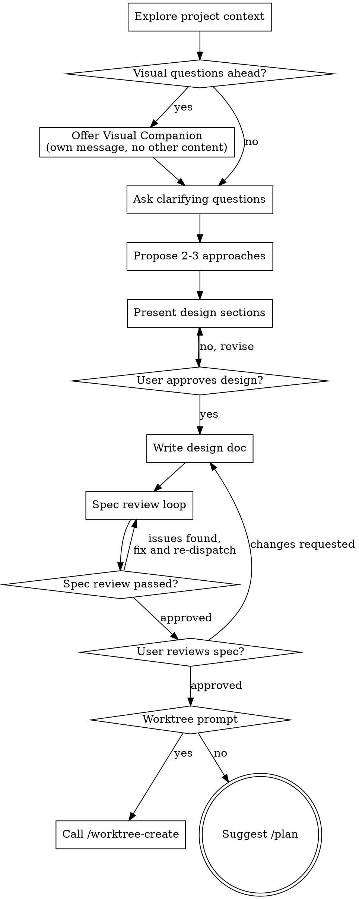

# Parallel Worktree Workflow Implementation Plan

> **For agentic workers:** REQUIRED SUB-SKILL: Use superpowers:subagent-driven-development (recommended) or superpowers:executing-plans to implement this plan task-by-task. Steps use checkbox (`- [ ]`) syntax for tracking.

**Goal:** Add 7 new skills (worktree-create/remove/status, port-assign/release/status, pr-create) and modify 2 existing skills (/spec, /code-review) to enable parallel development with git worktrees and automatic port management.

**Architecture:** Each skill is a standalone SKILL.md file in its own directory under `skills/`. Skills auto-register via the `"skills": ["./skills/"]` pattern in `plugin.json`. Skill chaining is defined within each SKILL.md — no new agents or code files needed.

**Tech Stack:** Claude Code plugin skills (Markdown), git worktree, lsof/nc for port checking, gh CLI for PR creation.

**Spec:** `docs/specs/2026-03-22-parallel-worktree-workflow-design.md`

---

## File Map

| Action | File | Responsibility |
|--------|------|----------------|
| Create | `skills/port-assign/SKILL.md` | Port block allocation with collision check |
| Create | `skills/port-release/SKILL.md` | Port block deallocation + process cleanup |
| Create | `skills/port-status/SKILL.md` | Port allocation overview with live status |
| Create | `skills/worktree-create/SKILL.md` | Git worktree creation + port-assign chaining |
| Create | `skills/worktree-remove/SKILL.md` | Git worktree removal + port-release chaining |
| Create | `skills/worktree-status/SKILL.md` | Worktree overview with directory validation |
| Create | `skills/pr-create/SKILL.md` | PR creation with template + gh CLI |
| Modify | `skills/spec/SKILL.md` | Add worktree prompt after spec completion |
| Modify | `skills/code-review/SKILL.md` | Add review-result.md saving + PR prompt |
| Modify | `CLAUDE.md` | Add new skills to architecture docs |
| Modify | `README.md` | Add new skills to user docs |

---

## Phase 1: Port Management Skills

Port skills are the foundation — worktree skills chain into them.

### Task 1: Create /port-assign skill

**Files:**
- Create: `skills/port-assign/SKILL.md`

- [ ] **Step 1: Create skill directory**

```bash
mkdir -p skills/port-assign
```

- [ ] **Step 2: Write SKILL.md**

```markdown
---
name: port-assign
description: "Allocate a port block for a worktree. Reads .flow/config.json for port definitions, finds the next available block in 10000-20000 range, verifies no collisions, and writes .env.flow. Called by /worktree-create or directly."
---

# Port Assign

Allocate a port block for a worktree from the 10000-20000 range using hybrid block-offset + collision check.

## Input

- `worktree` (required): Target worktree name

## Prerequisites

Check that `.flow/config.json` exists in the project root. If not, inform the user:

> ".flow/config.json not found. Create it with your port definitions to enable port management."
>
> Example:
> ```json
> {
>   "ports": {
>     "FRONTEND_PORT": 3000,
>     "API_PORT": 8080,
>     "DB_PORT": 5432
>   }
> }
> ```

## Allocation Process

### 1. Read Port Configuration

Read `.flow/config.json` and extract the `ports` object. The keys are environment variable names, values are original port numbers (used for documentation only — actual allocated ports come from the block).

### 2. Determine Next Available Block

Read `.flow/worktrees.json` (create empty `{}` if it doesn't exist). Find the lowest available block number:

- Blocks start at 10000 and increment by 100 (10000, 10100, 10200, ...)
- A block is "taken" if any entry in `worktrees.json` uses that block number
- Select the first untaken block

### 3. Map Ports Within Block

Assign ports sequentially within the block based on config key order:

```
Block 10000:
  1st key → 10000
  2nd key → 10001
  3rd key → 10002
  ...
```

### 4. Verify No Collisions

For each allocated port, check if it's already in use:

```bash
lsof -i :<port> -t 2>/dev/null
```

If any port in the block is occupied, move to the next block (10100, 10200, ...) and re-check. Maximum 10 retries.

If all 10 blocks have collisions, report error:

> "Could not find an available port block after 10 attempts (range 10000-20000). Please free up ports or assign manually."

### 5. Concurrent Access Guard

Before writing, re-read `.flow/worktrees.json` to verify the chosen block hasn't been taken by another session since step 2. If it has, recalculate from step 2.

### 6. Write .env.flow

Create `.env.flow` in the worktree directory (`.worktrees/<worktree>/`):

```
# Flow port assignment — block <block_number>
FRONTEND_PORT=10000
API_PORT=10001
DB_PORT=10002
```

### 7. Update worktrees.json

Update the worktree entry in `.flow/worktrees.json` with port information:

```json
{
  "<worktree>": {
    "block": 10000,
    "ports": {
      "FRONTEND_PORT": 10000,
      "API_PORT": 10001,
      "DB_PORT": 10002
    }
  }
}
```

Merge with existing entry if the worktree already has other fields (branch, path).

## Output

Display the allocated ports:

```
Port block allocated (block 10000):
  FRONTEND_PORT = 10000
  API_PORT      = 10001
  DB_PORT       = 10002

.env.flow written to .worktrees/<worktree>/.env.flow
```
```

- [ ] **Step 3: Verify file exists and is well-formed**

```bash
cat skills/port-assign/SKILL.md | head -5
```

Expected: frontmatter with `name: port-assign`

- [ ] **Step 4: Commit**

```bash
git add skills/port-assign/SKILL.md
git commit -m "feat: add /port-assign skill — port block allocation with collision check"
```

---

### Task 2: Create /port-release skill

**Files:**
- Create: `skills/port-release/SKILL.md`

- [ ] **Step 1: Create skill directory**

```bash
mkdir -p skills/port-release
```

- [ ] **Step 2: Write SKILL.md**

```markdown
---
name: port-release
description: "Release a port block for a worktree. Checks for running processes on allocated ports, removes .env.flow, and cleans up worktrees.json. Called by /worktree-remove or directly."
---

# Port Release

Release a previously allocated port block for a worktree.

## Input

- `worktree` (required): Target worktree name

## Release Process

### 1. Look Up Port Information

Read `.flow/worktrees.json` and find the entry for the target worktree. If no entry exists or no ports are assigned:

> "No port allocation found for worktree '<worktree>'."

### 2. Check for Running Processes

For each allocated port, check if a process is using it:

```bash
lsof -i :<port> -t 2>/dev/null
```

If any port has a running process, warn the user:

> "The following ports are still in use:"
> ```
> PORT    PID     COMMAND
> 10000   12345   node
> 10001   12346   python
> ```
> "Do you want to terminate these processes before releasing?"

If the user agrees, kill the processes:

```bash
kill <pid>
```

If the user declines, proceed with release anyway (the ports will be freed when the processes stop naturally).

### 3. Delete .env.flow

Remove the `.env.flow` file from the worktree directory:

```bash
rm -f .worktrees/<worktree>/.env.flow
```

### 4. Update worktrees.json

Remove the `block` and `ports` fields from the worktree entry in `.flow/worktrees.json`. If the entry has no other fields (branch, path), remove the entire entry.

## Output

```
Port block released (block 10000):
  FRONTEND_PORT = 10000 (freed)
  API_PORT      = 10001 (freed)
  DB_PORT       = 10002 (freed)

.env.flow removed from .worktrees/<worktree>/
```
```

- [ ] **Step 3: Commit**

```bash
git add skills/port-release/SKILL.md
git commit -m "feat: add /port-release skill — port block deallocation with process cleanup"
```

---

### Task 3: Create /port-status skill

**Files:**
- Create: `skills/port-status/SKILL.md`

- [ ] **Step 1: Create skill directory**

```bash
mkdir -p skills/port-status
```

- [ ] **Step 2: Write SKILL.md**

```markdown
---
name: port-status
description: "Display current port allocation status across all worktrees. Shows allocated ports and whether each port is actively in use. Invoke to check port usage."
---

# Port Status

Display current port allocation status across all worktrees with live process detection.

## Process

### 1. Read State

Read `.flow/worktrees.json`. If file doesn't exist or is empty:

> "No worktrees with port allocations found. Use /worktree-create to create a worktree with port management."

### 2. Check Each Port

For each port in each worktree entry, check live status:

```bash
lsof -i :<port> -t 2>/dev/null
```

### 3. Display Results

```
WORKTREE   ENV_VAR         PORT    IN_USE
auth       FRONTEND_PORT   10000   yes (pid: 12345)
auth       API_PORT        10001   yes (pid: 12346)
auth       DB_PORT         10002   no
payments   FRONTEND_PORT   10100   no
payments   API_PORT        10101   no
payments   DB_PORT         10102   no

Total: 2 worktrees, 6 ports allocated, 2 in use
```
```

- [ ] **Step 3: Commit**

```bash
git add skills/port-status/SKILL.md
git commit -m "feat: add /port-status skill — port allocation overview with live status"
```

---

## Phase 2: Worktree Management Skills

These skills use port skills via chaining.

### Task 4: Create /worktree-create skill

**Files:**
- Create: `skills/worktree-create/SKILL.md`

- [ ] **Step 1: Create skill directory**

```bash
mkdir -p skills/worktree-create
```

- [ ] **Step 2: Write SKILL.md**

```markdown
---
name: worktree-create
description: "Create an isolated git worktree for parallel development. Allocates a port block if .flow/config.json exists. Called after /spec completion or directly. Creates branch, worktree directory, and guides the user to start a new Claude Code session."
---

# Worktree Create

Create an isolated git worktree for parallel feature development with automatic port management.

## Input

- `name` (optional): Worktree name. If omitted, extract from spec filename (e.g., `2026-03-22-auth-design.md` → `auth`) or ask the user.
- `branch` (optional): Branch name. Defaults to `feature/<name>`.
- `spec` (optional): Spec file path. Auto-passed when chained from `/spec`.

## Process

### 1. Determine Name and Branch

**If `name` is provided:** use it directly.

**If `spec` is provided but not `name`:** extract name from the spec filename:
- Pattern: `YYYY-MM-DD-<name>-design.md`
- Example: `2026-03-22-user-auth-design.md` → `user-auth`

**If neither is provided:** ask the user:
> "What name would you like for this worktree? (This will be used for the branch name and directory)"

**Branch:** if not provided, default to `feature/<name>`.

### 2. Validate

- Check the branch doesn't already exist: `git branch --list <branch>`
- Check `.worktrees/<name>` directory doesn't already exist
- If either exists, inform the user and ask for a different name

### 3. Create Worktree

```bash
git worktree add .worktrees/<name> -b <branch>
```

### 4. Initialize .flow Directory

Ensure `.flow/` directory exists in the project root (not in the worktree):

```bash
mkdir -p .flow
```

If `.flow/worktrees.json` doesn't exist, create it with `{}`.

### 5. Update worktrees.json

Add the new worktree entry:

```json
{
  "<name>": {
    "branch": "<branch>",
    "path": "<absolute-path-to-.worktrees/name>"
  }
}
```

### 6. Port Assignment (conditional)

If `.flow/config.json` exists, invoke the `/port-assign` skill with `worktree=<name>`.

If `.flow/config.json` does not exist, skip port assignment and inform:
> "No .flow/config.json found — skipping port management. Create one to enable automatic port allocation."

### 7. Spec File Access

> **Spec override:** The spec (step 5 of /worktree-create) says "spec 파일을 worktree 디렉토리의 동일 경로에 복사". This is unnecessary because git worktrees share the full git history — committed files (including the spec) are already accessible at the same path in the worktree. No copy needed.

If `spec` argument was provided, confirm the spec file is accessible in the worktree and note the path for the user.

### 8. Update .gitignore

Check if `.worktrees/` and `.flow/worktrees.json` are in `.gitignore`. If not, offer to add:

```
# Flow parallel development
.worktrees/
.flow/worktrees.json
.flow/review-result.md
```

### 9. Output

Display creation summary and next steps:

```
Worktree created:
  Name:   <name>
  Path:   <absolute-path>
  Branch: <branch>
  Ports:  FRONTEND_PORT=10000, API_PORT=10001, DB_PORT=10002  (or "none — no config.json")

Next: open a new terminal and start a Claude Code session:
  cd <absolute-path> && claude

Then run /plan to create the implementation plan.
```

## Chaining

This skill is called by `/spec` when the user agrees to worktree-based development. It can also be called directly via `/worktree-create`.
```

- [ ] **Step 3: Commit**

```bash
git add skills/worktree-create/SKILL.md
git commit -m "feat: add /worktree-create skill — git worktree creation with port chaining"
```

---

### Task 5: Create /worktree-remove skill

**Files:**
- Create: `skills/worktree-remove/SKILL.md`

- [ ] **Step 1: Create skill directory**

```bash
mkdir -p skills/worktree-remove
```

- [ ] **Step 2: Write SKILL.md**

```markdown
---
name: worktree-remove
description: "Remove a git worktree and release its port block. Auto-detects current worktree or accepts a name argument. Checks for running processes before cleanup. Invoke when done with a parallel development branch."
---

# Worktree Remove

Remove a git worktree and release its allocated port block.

## Input

- `name` (optional): Worktree name. If omitted, auto-detect from current directory.

## Auto-Detection

If `name` is not provided, check the current working directory:

1. Get the current path
2. Check if it contains `/.worktrees/` in the path
3. If yes, extract the name: `/project/.worktrees/<name>/...` → `<name>`
4. If no, read `.flow/worktrees.json` and list all registered worktrees for the user to choose:

> "Which worktree would you like to remove?"
> ```
> 1. auth (feature/auth, block 10000)
> 2. payments (feature/payments, block 10100)
> ```

## Process

### 1. Validate

Read `.flow/worktrees.json` and confirm the worktree entry exists. If not:

> "Worktree '<name>' not found in .flow/worktrees.json. Check /worktree-status for registered worktrees."

### 2. Check Running Processes

Check if any allocated ports have active processes:

```bash
lsof -i :<port> -t 2>/dev/null
```

If processes are found, warn and ask:

> "Active processes found on worktree ports:"
> ```
> PORT    PID     COMMAND
> 10000   12345   node
> ```
> "Terminate these processes? (Y/n)"

### 3. Release Ports

Invoke `/port-release` skill with `worktree=<name>`.

### 4. Remove Worktree

If the current directory is inside the worktree being removed, warn:

> "You are currently inside the worktree being removed. Please change to the project root first."

Otherwise:

```bash
git worktree remove .worktrees/<name>
```

If the worktree has uncommitted changes, git will refuse. Inform the user:

> "Worktree has uncommitted changes. Commit or stash them first, or use `git worktree remove --force .worktrees/<name>` to discard."

### 5. Update worktrees.json

Remove the entry from `.flow/worktrees.json`.

### 6. Branch Cleanup

Ask the user:

> "Delete branch '<branch>'? (Y/n)"

If yes:

```bash
git branch -d <branch>
```

If the branch is not fully merged, inform and offer force delete:

> "Branch '<branch>' is not fully merged. Force delete? (y/N)"

## Output

```
Worktree removed:
  Name:   <name>
  Branch: <branch> (deleted / kept)
  Ports:  released (block 10000)
```
```

- [ ] **Step 3: Commit**

```bash
git add skills/worktree-remove/SKILL.md
git commit -m "feat: add /worktree-remove skill — worktree cleanup with port release chaining"
```

---

### Task 6: Create /worktree-status skill

**Files:**
- Create: `skills/worktree-status/SKILL.md`

- [ ] **Step 1: Create skill directory**

```bash
mkdir -p skills/worktree-status
```

- [ ] **Step 2: Write SKILL.md**

```markdown
---
name: worktree-status
description: "Display all registered worktrees with their branch, port block, and directory status. Detects stale entries where the directory has been manually removed. Invoke to check parallel development status."
---

# Worktree Status

Display all registered worktrees with validation.

## Process

### 1. Read State

Read `.flow/worktrees.json`. If file doesn't exist or is empty:

> "No worktrees registered. Use /worktree-create to create one."

### 2. Validate Each Entry

For each worktree entry:
- Check if the directory exists: `.worktrees/<name>/`
- If directory exists: status = `active`
- If directory doesn't exist: status = `missing`

### 3. Display Results

```
NAME       BRANCH           BLOCK   PORTS                              STATUS
auth       feature/auth     10000   FRONTEND:10000,API:10001,DB:10002  active
payments   feature/payments 10100   FRONTEND:10100,API:10101,DB:10102  active
old-feat   feature/old      10200   FRONTEND:10200,API:10201,DB:10202  missing
```

If any worktree has no port assignment:

```
NAME       BRANCH           BLOCK   PORTS   STATUS
simple     feature/simple   -       none    active
```

### 4. Handle Missing Entries

If any worktree has `missing` status:

> "Found stale worktree entries (directory not found). Clean up these entries? (Y/n)"

If yes, remove the stale entries from `.flow/worktrees.json` and run `/port-release` for each.

### 5. Cross-Check with Git

Also run `git worktree list` and compare with `.flow/worktrees.json`. If there are worktrees in git that aren't in the JSON (created outside of Flow), note them:

> "Note: Found git worktrees not managed by Flow:"
> ```
> /project/.worktrees/manual-branch  abc1234 [manual-branch]
> ```
```

- [ ] **Step 3: Commit**

```bash
git add skills/worktree-status/SKILL.md
git commit -m "feat: add /worktree-status skill — worktree overview with directory validation"
```

---

## Phase 3: PR Creation Skill

Independent of worktree/port skills.

### Task 7: Create /pr-create skill

**Files:**
- Create: `skills/pr-create/SKILL.md`

- [ ] **Step 1: Create skill directory**

```bash
mkdir -p skills/pr-create
```

- [ ] **Step 2: Write SKILL.md**

```markdown
---
name: pr-create
description: "Create a GitHub pull request with a structured template. Auto-populates from spec, plan, git diff, test results, and code-review output. Called after /code-review or directly."
---

# PR Create

Create a GitHub pull request with a structured template populated from Flow artifacts.

## Prerequisites

- `gh` CLI must be installed and authenticated
- Current branch must have a remote tracking branch (or will be pushed)

Check prerequisites:

```bash
gh auth status
```

If not authenticated:

> "GitHub CLI is not authenticated. Run `gh auth login` first."

## Process

### 1. Detect Spec and Plan

Scan `docs/specs/` and `docs/plans/` for matching documents:

- If inside a worktree, check `.flow/worktrees.json` for the worktree name, then match spec/plan files by topic
- If multiple matches, list them and ask the user to confirm
- If no matches, leave the fields as "(no spec found)" / "(no plan found)"

### 2. Generate Change Summary

```bash
# Get the base branch (usually main or master)
git symbolic-ref refs/remotes/origin/HEAD | sed 's@^refs/remotes/origin/@@'

# Generate diff summary against base
git diff <base-branch>...HEAD --stat
git diff <base-branch>...HEAD
```

Summarize the changes in 3-5 bullet points covering what was added, modified, or removed.

### 3. Collect Test Results

Detect the project's test runner and execute:

1. Check for test configuration in order:
   - `package.json` → `npm test`
   - `Makefile` with `test` target → `make test`
   - `pyproject.toml` or `setup.py` → `pytest` or `python -m pytest`
   - `go.mod` → `go test ./...`
   - `Cargo.toml` → `cargo test`

2. Run the detected test command:

```bash
<detected-test-command> 2>&1 || true
```

3. Extract: total tests, passed, failed, coverage percentage if available.

If no test runner is detected, note: "(no test runner detected — run tests manually and paste results)"

### 4. Read Code Review Results

Check for `.flow/review-result.md`:

- If exists, read and summarize the verdict (Approve/Warning/Block) and key findings
- If not exists, note: "(code-review not run — run /code-review first for a complete PR)"

### 5. Build PR Content

**Title:** Generate from branch name or spec title. Present to user for editing.

**Body template:**

```markdown
## Summary
- **Spec:** <spec-path or "N/A">
- **Plan:** <plan-path or "N/A">

## Changes
<3-5 bullet point summary from git diff>

## Test Results
<test summary: X passed, Y failed, Z% coverage>

## Code Review
<review verdict and key findings summary>
```

### 6. User Review

Present the complete PR title and body to the user:

> "Here's the PR content. Edit the title or body, or confirm to create:"
>
> **Title:** `<generated title>`
>
> **Body:**
> ```
> <generated body>
> ```
>
> "Create this PR? (Y/edit/n)"

If "edit": ask which part to change, apply changes, re-present.

### 7. Push and Create PR

```bash
# Push current branch if not already pushed
git push -u origin <branch>

# Create PR
gh pr create --title "<title>" --body "<body>"
```

### 8. Output

```
PR created: <PR URL>
  Title: <title>
  Base:  <base-branch>
  Head:  <branch>
```

## Chaining

This skill is called by `/code-review` when the user agrees to PR creation. It can also be called directly via `/pr-create`.
```

- [ ] **Step 3: Commit**

```bash
git add skills/pr-create/SKILL.md
git commit -m "feat: add /pr-create skill — PR creation with template and gh CLI"
```

---

## Phase 4: Modify Existing Skills

### Task 8: Modify /spec skill — add worktree prompt

**Files:**
- Modify: `skills/spec/SKILL.md`

- [ ] **Step 1: Read current SKILL.md**

Read `skills/spec/SKILL.md` to understand current structure.

- [ ] **Step 2: Replace the entire Process Flow diagram**

Replace the full `digraph spec { ... }` block (lines 37-67 in the current file) with the following. This adds a "Worktree prompt" diamond between "User reviews spec?" and "Suggest /plan":



- [ ] **Step 3: Update terminal state description**

Change line 69:
```
**The terminal state is user approval of the spec, then suggest `/plan`.** Do NOT jump to implementation directly.
```

To:
```
**After user approves the spec, ask about worktree.** If yes, call `/worktree-create` (passing the spec path). If no, suggest `/plan`. Do NOT jump to implementation directly.
```

- [ ] **Step 4: Add Worktree Prompt section before Amend Mode**

Insert a new section before "## Amend Mode" (before line 160):

```markdown
## Worktree Prompt

After the user approves the spec and before suggesting `/plan`:

1. Ask the user:
   > "Would you like to work on this in an isolated worktree? This enables parallel development with automatic port management. (Y/n)"

2. **If yes:** Invoke `/worktree-create` with `spec=<spec-file-path>`. The worktree-create skill will guide the user to start a new session.

3. **If no:** Suggest `/plan` as before:
   > "Run `/plan <spec-path>` to create the implementation plan."
```

- [ ] **Step 5: Update checklist item 9**

Change:
```
9. **Transition to implementation** -- suggest user run `/plan` with the spec path
```

To:
```
9. **Worktree prompt** -- ask if user wants worktree-based development; if yes call /worktree-create, if no suggest /plan
```

- [ ] **Step 6: Commit**

```bash
git add skills/spec/SKILL.md
git commit -m "feat: add worktree prompt to /spec skill after spec approval"
```

---

### Task 9: Modify /code-review skill — add review saving + PR prompt

**Files:**
- Modify: `skills/code-review/SKILL.md`

- [ ] **Step 1: Read current SKILL.md**

Read `skills/code-review/SKILL.md` to understand current structure.

- [ ] **Step 2: Add review result saving section**

After the "## Blocking Rules" section (after line 46), add:

```markdown
## Save Review Results

After presenting the review report, save the results to `.flow/review-result.md`:

```bash
mkdir -p .flow
```

Write the review verdict and findings summary to `.flow/review-result.md`. This file is used by `/pr-create` to populate the PR template.

Format:
```markdown
# Code Review Result
**Date:** YYYY-MM-DD
**Verdict:** Approve / Warning / Block

## Findings
<copy of the review findings table>

## Summary
<1-2 sentence summary>
```
```

- [ ] **Step 3: Add PR prompt section**

After the new "Save Review Results" section, add:

```markdown
## PR Creation Prompt

After saving the review results:

1. Ask the user:
   > "Would you like to create a PR? (Y/n)"

2. **If yes:** Invoke `/pr-create`. The pr-create skill will gather all artifacts and create the PR.

3. **If no:** End the review process. The user can run `/pr-create` later or continue with `/amend` for modifications.
```

- [ ] **Step 4: Commit**

```bash
git add skills/code-review/SKILL.md
git commit -m "feat: add review-result saving and PR prompt to /code-review skill"
```

---

## Phase 5: Documentation

### Task 10: Update CLAUDE.md

**Files:**
- Modify: `CLAUDE.md`

- [ ] **Step 1: Read current CLAUDE.md**

Read `CLAUDE.md`.

- [ ] **Step 2: Add new skills to architecture table**

In the "### Skills" section, add the new skills. Update from "(5)" to "(12)":

```markdown
### Skills (12)

- **skills/spec/** - Design spec creation with visual companion
- **skills/plan/** - Spec-to-plan conversion with phased implementation
- **skills/tdd/** - TDD workflow with mocking patterns and coverage
- **skills/amend/** - Revision orchestrator (spec → plan → TDD)
- **skills/code-review/** - Security and quality review + PR prompt
- **skills/worktree-create/** - Git worktree creation with port allocation
- **skills/worktree-remove/** - Worktree cleanup with port release
- **skills/worktree-status/** - Worktree overview and validation
- **skills/port-assign/** - Port block allocation (10000-20000)
- **skills/port-release/** - Port block deallocation
- **skills/port-status/** - Port allocation status with live detection
- **skills/pr-create/** - PR creation with structured template
```

- [ ] **Step 3: Add Parallel Development section**

After the "## Running the Visual Companion Server" section, add:

```markdown
## Parallel Development with Worktrees

```
/spec "feature" → worktree prompt → /worktree-create → new session → /plan → /tdd → /code-review → /pr-create
```

Port configuration: `.flow/config.json`
Worktree state: `.flow/worktrees.json` (auto-managed)
```

- [ ] **Step 4: Commit**

```bash
git add CLAUDE.md
git commit -m "docs: add parallel worktree workflow to CLAUDE.md"
```

---

### Task 11: Update README.md

**Files:**
- Modify: `README.md`

- [ ] **Step 1: Read current README.md**

Read `README.md`.

- [ ] **Step 2: Add workflow commands**

In the workflow command list at the top, add the new commands:

```markdown
/worktree-create   → worktree 생성 + 포트 할당
/worktree-remove   → worktree 정리 + 포트 해제
/worktree-status   → worktree 현황 조회
/port-assign       → 포트 블록 할당
/port-release      → 포트 블록 해제
/port-status       → 포트 현황 조회
/pr-create         → PR 생성 (템플릿 기반)
```

- [ ] **Step 3: Add Parallel Development section**

Add the following section after "## How It Works" (before "## Visual Companion"):

```markdown
## Parallel Development

여러 spec을 동시에 개발할 때 git worktree와 포트 자동 관리를 사용합니다.

### Setup

프로젝트 루트에 `.flow/config.json`을 생성하여 포트를 정의합니다:

```json
{
  "ports": {
    "FRONTEND_PORT": 3000,
    "API_PORT": 8080,
    "DB_PORT": 5432
  }
}
```

### Workflow

각 터미널에서 독립적으로 하나의 기능을 개발합니다:

```
Terminal 1:                         Terminal 2:
/spec "인증 기능"                    /spec "결제 기능"
  -> worktree 생성 + 포트 할당        -> worktree 생성 + 포트 할당
  -> 새 세션에서 /plan → /tdd         -> 새 세션에서 /plan → /tdd
  -> /code-review → /pr-create       -> /code-review → /pr-create
  -> /worktree-remove                -> /worktree-remove
```

### Port Block Allocation

- 범위: 10000~20000, 블록 단위 100
- worktree-1: `FRONTEND_PORT=10000, API_PORT=10001, DB_PORT=10002`
- worktree-2: `FRONTEND_PORT=10100, API_PORT=10101, DB_PORT=10102`
- 각 포트는 할당 전에 충돌 여부를 자동 검증

### Commands

| 명령어 | 설명 |
|--------|------|
| `/worktree-create` | worktree 생성 + 포트 할당 |
| `/worktree-remove` | worktree 정리 + 포트 해제 |
| `/worktree-status` | 전체 worktree 현황 조회 |
| `/port-assign` | 포트 블록 할당 |
| `/port-release` | 포트 블록 해제 |
| `/port-status` | 포트 할당 현황 조회 |
| `/pr-create` | PR 생성 (템플릿 기반) |
```

- [ ] **Step 4: Update What's Inside structure**

Add the new skill directories to the directory tree:

```
|-- skills/
|   |-- worktree-create/       # /worktree-create
|   |   |-- SKILL.md
|   |-- worktree-remove/       # /worktree-remove
|   |   |-- SKILL.md
|   |-- worktree-status/       # /worktree-status
|   |   |-- SKILL.md
|   |-- port-assign/           # /port-assign
|   |   |-- SKILL.md
|   |-- port-release/          # /port-release
|   |   |-- SKILL.md
|   |-- port-status/           # /port-status
|   |   |-- SKILL.md
|   |-- pr-create/             # /pr-create
|       |-- SKILL.md
```

- [ ] **Step 5: Commit**

```bash
git add README.md
git commit -m "docs: add parallel worktree workflow to README.md"
```

---

## Execution Order Summary

```
Phase 1 (foundation):    Task 1-3  — port-assign, port-release, port-status
Phase 2 (core):          Task 4-6  — worktree-create, worktree-remove, worktree-status
Phase 3 (independent):   Task 7    — pr-create
Phase 4 (integration):   Task 8-9  — modify /spec, modify /code-review
Phase 5 (docs):          Task 10-11 — CLAUDE.md, README.md
```

Tasks 1-3 can be done in parallel. Tasks 4-6 can be done in parallel (after Phase 1). Task 7 is independent. Tasks 8-9 can be done in parallel (after Phase 2 and 3). Tasks 10-11 can be done in parallel (after all prior tasks).
