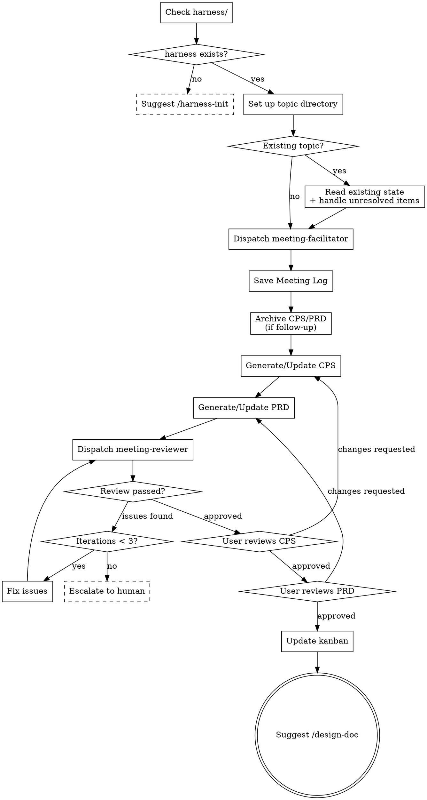

# Meeting: Ideas Into Requirements

Conduct structured dialogue to turn ideas into clear, validated requirements. Produces three document types: Meeting Log (dialogue record), CPS (Context-Problem-Solution), and PRD (Product Requirements Document).

This is the **most important step** in the workflow. Thoroughness matters more than speed. Every assumption not examined here becomes a problem later.

<HARD-GATE>
Do NOT invoke any implementation skill, write any code, scaffold any project, or take any design/architecture action until CPS and PRD are produced and approved. This applies to EVERY project regardless of perceived simplicity.
</HARD-GATE>

## Anti-Pattern: "This Is Too Simple To Need A Meeting"

Every project goes through this process. A config change, a single utility, a minor feature -- all of them. "Simple" projects are where unexamined assumptions cause the most wasted work. The meeting can be short (a few questions for truly simple topics), but you MUST produce CPS and PRD and get approval.

## Checklist

You MUST complete these items in order:

1. **Check harness directory** -- verify `harness/` exists; if not, suggest `/harness-init` and stop
2. **Set up topic directory** -- if new topic, create `harness/topics/<topic>/` and `meetings/` and `history/` subdirectories; if existing topic, read current state (Meeting Logs, CPS, PRD, kanban)
3. **Dispatch meeting-facilitator** -- conduct structured dialogue with the user
4. **Save Meeting Log** -- write to `harness/topics/<topic>/meetings/YYYY-MM-DD-<session>.md`
5. **Generate CPS document** -- write to `harness/topics/<topic>/cps.md`
6. **Generate PRD document** -- write to `harness/topics/<topic>/prd.md`
7. **Dispatch meeting-reviewer** -- validate CPS and PRD (max 3 iterations; fix issues and re-dispatch until approved; if 3 iterations exhausted, escalate to human)
8. **User reviews CPS** -- present CPS to user for approval; if changes requested, update and re-run reviewer
9. **User reviews PRD** -- present PRD to user for approval; if changes requested, update and re-run reviewer
10. **Update kanban** -- update both `harness/topics/<topic>/kanban.json` and `harness/kanban.json`
11. **Suggest next step** -- suggest `/design-doc <topic>` to create the design document

## Follow-Up Execution (`/meeting <existing-topic>`)

When invoked with an existing topic:

1. **Read existing state** -- read all Meeting Logs, current CPS, PRD, and kanban from `harness/topics/<topic>/`
2. **Review unresolved items** -- present unresolved items from previous meetings; check if later decisions invalidated any (auto-remove with reason); re-confirm still-valid ones with user
3. **Continue dialogue** -- dispatch meeting-facilitator in follow-up mode; user should not need to repeat previously captured information
4. **Archive CPS/PRD** -- before updating, archive current versions to `history/` using FIFO rotation:
   - Max 2 archived versions per document (v1 = most recent prior, v2 = older)
   - If `history/<doc>.v2.md` exists, delete it
   - If `history/<doc>.v1.md` exists, rename it to `history/<doc>.v2.md`
   - Copy current `<doc>.md` to `history/<doc>.v1.md`
5. **Update CPS/PRD** -- write updated documents with changes highlighted
6. **Re-run meeting-reviewer** -- validate updated documents (max 3 iterations)
7. **User review** -- present updated CPS then PRD for approval
8. **Update kanban** -- update topic and root kanban files

## Process Flow



## Document Flow

```
harness/topics/<topic>/
├── kanban.json
├── meetings/
│   ├── YYYY-MM-DD-session-1.md
│   ├── YYYY-MM-DD-session-2.md
│   └── ...
├── cps.md
├── prd.md
└── history/
    ├── cps.v1.md
    ├── cps.v2.md
    ├── prd.v1.md
    └── prd.v2.md
```

## Key Principles

- **One question at a time** -- do not overwhelm the user with multiple questions
- **Multiple choice preferred** -- easier to answer than open-ended when the option space is known
- **Track unresolved items carefully** -- when conversation shifts without confirmation, record it; check if later decisions invalidate earlier unresolved items
- **This is the MOST IMPORTANT step** -- thoroughness over speed, every time
- **No implementation leakage** -- CPS and PRD describe what and why, never how
- **Incremental validation** -- get user confirmation at each stage before moving forward
- **Follow-up continuity** -- the user should never need to repeat information from previous meetings

## Kanban Schema

### Topic kanban (`harness/topics/<topic>/kanban.json`)

```json
{
  "topic": "<topic>",
  "phase": "meeting",
  "last_updated": "YYYY-MM-DD",
  "meetings": [
    {"date": "YYYY-MM-DD", "file": "meetings/YYYY-MM-DD-<session>.md"}
  ],
  "steps": {
    "done": [],
    "in_progress": [{"id": "meeting", "name": "Meeting"}],
    "backlog": [
      {"id": "cps", "name": "CPS"},
      {"id": "prd", "name": "PRD"}
    ]
  }
}
```

### Root kanban (`harness/kanban.json`)

The root kanban tracks all topics at a summary level. Update it with the topic's current phase and last_updated date whenever the topic kanban changes.

---

**After user approves CPS and PRD, suggest `/design-doc <topic>`.** Do NOT jump to implementation or planning directly.
